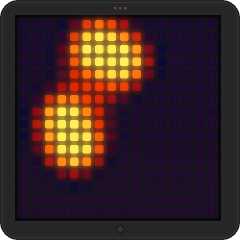
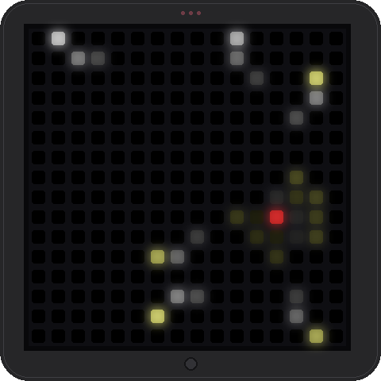
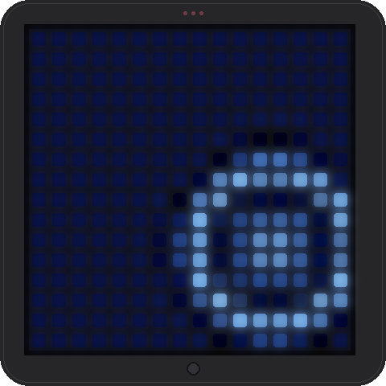
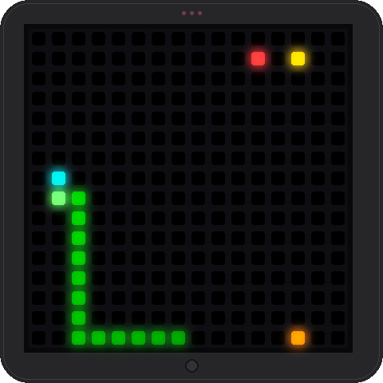
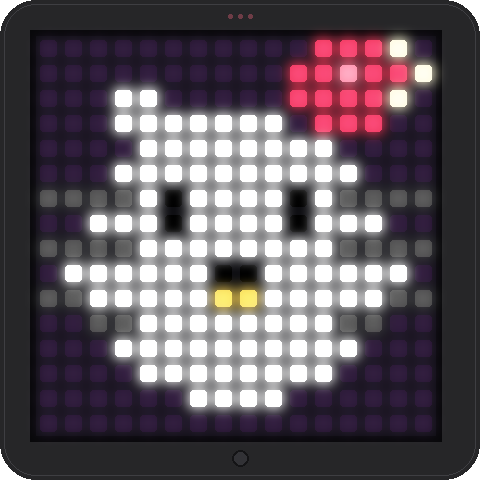

# PixooCtrl

Control a Divoom Pixoo 16x16 LED display from Windows via Bluetooth — no vendor app required.

## Overview

This project provides:

**Setup**

- **`setup.ps1`** — Windows setup flow: checks Python 3.9+, creates a virtual environment, installs Pillow, verifies the Bluetooth adapter and `socket.AF_BLUETOOTH` support, scans for a paired Pixoo/Divoom device, and saves `pixoo_config.json`. Run it once before pairing and again after pairing.
- **`setup.sh`** — Linux setup flow: same as above, plus a check for BlueZ tooling (`bluetoothctl`).

**Library & tests**

- **`pixoo.py`** — Python control library: pixel buffer with `set_pixel()` / `show()`, image and GIF sending, brightness, solid color, and mode control over Bluetooth Classic (RFCOMM).
- **`test_pixoo.py`** — Visual test suite: 8 tests including solid colors, brightness ramp, diagonal line, checkerboard, nested rectangles, gradient, smiley face, and clock mode.

**Demos** (each runnable on the device, in `--preview` mode for PNGs, or in `--simulate` mode for an on-screen window)

- **`lava_lamp.py`** — Lava lamp simulation using metaballs, rendered at 64x64 and downscaled to 16x16.
- **`plasma.py`** — Classic demoscene plasma effect with layered sine/cosine waves and cycling color palette.
- **`starfield.py`** — Starfield warp effect — stars stream outward from the center with trails and glow.
- **`rain.py`** — Top-down rain & ripples on a dark water surface using 2D wave-equation simulation.
- **`snake.py`** — Endless auto-playing snake game with AI steering, growth, and a dramatic death animation.
- **`hello_kitty.py`** — Hello Kitty face with natural-looking random eye blinks.
- **`flappy.py`** — Endless auto-piloted flappy bird simulation: a small bird hovers near the centre while pipes scroll past from right to left.

**Tooling**

- **`gen_previews.py`** — Developer tool: regenerates the simulated-Pixoo preview images shown below in `images/` by running each demo headlessly and compositing the captured 16x16 frame onto a synthetic device bezel.

## Requirements

### Windows

- Windows 10/11
- PowerShell 5.1 or PowerShell 7+
- Python 3.9 or later (for `socket.AF_BLUETOOTH` support)
- A Bluetooth adapter (built-in or USB dongle)
- A Divoom Pixoo 16x16 device

### Linux

- A Linux distribution with BlueZ Bluetooth support installed and running (`bluetoothd`, `bluetoothctl`)
- Python 3.9 or later with `socket.AF_BLUETOOTH` support
- `python3-venv` (or the equivalent package for your distro) so you can create a virtual environment
- A Bluetooth adapter (built-in or USB dongle)
- A Divoom Pixoo 16x16 device paired through your desktop Bluetooth settings or `bluetoothctl`

The PowerShell helper script in this repo is Windows-only. On Linux, use `./setup.sh`, then pair the device and re-run it so it can save `pixoo_config.json`.

## How to Use

### Windows

```powershell
# 1. Install prerequisites (Python venv, Pillow, BT adapter check)
.\setup.ps1

# 2. Pair your Pixoo in Windows Bluetooth Settings, then run setup again
.\setup.ps1

# 3. Run the visual tests
.\.venv\Scripts\python.exe test_pixoo.py
```

### Linux

```bash
# 1. Install prerequisites, create .venv, install Pillow, and check BlueZ
chmod +x ./setup.sh
./setup.sh

# 2. Pair the Pixoo in your desktop Bluetooth settings or with bluetoothctl,
#    then re-run setup.sh so it can detect the paired device and save
#    pixoo_config.json automatically
./setup.sh

# 3. Run the visual tests
./.venv/bin/python test_pixoo.py
```

If your distro ships multiple Python binaries, make sure `python` inside the virtual environment resolves to the same interpreter used to create it.

If `setup.sh` cannot identify the Pixoo automatically, create `pixoo_config.json` manually in the repo root with the device MAC address and `bt_port` set to `1`.

To verify BlueZ support on Linux manually, check these before pairing:

- `bluetoothctl --version` should succeed.
- `systemctl status bluetooth` should show the service as active on systemd-based distros.
- `bluetoothctl list` should show at least one controller.
- `bluetoothctl devices Paired` will show whether the Pixoo is already paired.

If Bluetooth access still fails on Linux, verify that BlueZ is running and that your user can access the Bluetooth stack on the host.

#### Pairing the Pixoo with `bluetoothctl`

If your desktop environment doesn't ship a Bluetooth GUI (or it doesn't see the Pixoo), you can pair from the terminal with `bluetoothctl`. The Pixoo is a Bluetooth Classic (BR/EDR) device, so the procedure differs slightly from BLE devices: you must explicitly start a classic discovery scan, trust the device before pairing, and you do **not** need to `connect` afterwards (PixooCtrl opens its own RFCOMM socket).

1. **Power on the Pixoo and make sure no other host is connected to it.** If the Divoom phone app or another computer is already paired and connected, disconnect it first — the Pixoo only accepts one Bluetooth Classic connection at a time.

2. **Start an interactive `bluetoothctl` session:**

    ```bash
    bluetoothctl
    ```

    You will get a `[bluetooth]#` prompt. All the commands below are typed at this prompt (not in your normal shell).

3. **Confirm the controller is up and powered:**

    ```text
    list
    show
    power on
    agent on
    default-agent
    ```

    `list` should print at least one controller (e.g. `Controller AA:BB:CC:DD:EE:FF [default]`). `show` should report `Powered: yes`. `agent on` + `default-agent` registers a pairing agent so PIN/confirmation prompts (if any) are handled inside this session.

4. **Scan for the Pixoo.** The Pixoo advertises as a Bluetooth Classic device, so use a BR/EDR scan rather than the default LE scan:

    ```text
    menu scan
    transport bredr
    back
    scan on
    ```

    Wait 10–30 seconds. You should see a line like:

    ```text
    [NEW] Device 11:75:58:XX:XX:XX Pixoo
    ```

    The MAC address is what you need. If nothing shows up, try `scan off` then `scan on` again, and make sure the Pixoo is on its main screen (not in firmware-update mode).

5. **Stop scanning and pair.** Replace `11:75:58:XX:XX:XX` with the MAC printed above:

    ```text
    scan off
    trust 11:75:58:XX:XX:XX
    pair 11:75:58:XX:XX:XX
    ```

    `trust` first is important — without it the Pixoo will often reject the pairing or drop the link immediately afterwards. If pairing prompts for a PIN, the Pixoo accepts `0000` (some firmware revisions also accept `1234`). On success you will see `Pairing successful`.

6. **Do not run `connect`.** PixooCtrl manages its own RFCOMM socket on port 1; an active `bluetoothctl` connection will block it. Just verify the device is now paired and exit:

    ```text
    devices Paired
    exit
    ```

    The Pixoo MAC should appear in the `Paired` list.

7. **Re-run `./setup.sh`** so it can detect the now-paired device and write `pixoo_config.json`.

Common `bluetoothctl` failure modes:

- **`Failed to pair: org.bluez.Error.AuthenticationFailed`** — another host is already connected to the Pixoo, or the Pixoo is in a stuck state. Power-cycle it (unplug for ~5 seconds) and retry from step 4.
- **`Failed to pair: org.bluez.Error.ConnectionAttemptFailed`** — the controller didn't see the Pixoo as a classic device. Make sure you ran `menu scan` → `transport bredr` → `back` before `scan on`.
- **The Pixoo never shows up under `scan on`** — confirm `show` reports `Discoverable: yes` and `Pairable: yes`; if not, run `discoverable on` and `pairable on`. Also check `rfkill list bluetooth` outside the prompt to make sure the adapter isn't soft-blocked.
- **Pairing succeeds but PixooCtrl can't open the socket** — run `bluetoothctl disconnect 11:75:58:XX:XX:XX` so BlueZ releases the link, then retry. The pairing is persistent; only the active connection needs to be dropped.

## What's Automated vs Manual

| Step | Automation |
|---|---|
| Python / venv / Pillow setup | Fully automated (`setup.ps1`) |
| Bluetooth adapter detection | Fully automated (`setup.ps1`) |
| Scanning paired devices from Windows registry | Fully automated (`setup.ps1`) |
| MAC address extraction & config saving | Fully automated (`setup.ps1`) |
| Bluetooth pairing | Semi-automated — `setup.ps1` opens `ms-settings:bluetooth`; you click "Add device → Bluetooth → Pixoo" in the Settings window, then run `setup.ps1` again to save config. |

> **Why isn't pairing fully automated?** Windows doesn't expose a CLI or API for Classic Bluetooth pairing. The script automates everything around it (opening Settings, detecting paired devices, and saving config after you pair).

## Using the Library in Your Own Code

To embed PixooCtrl in another project, copy these files into your project root:

- **`pixoo.py`** — the control library itself (the only runtime dependency, plus Pillow).
- **`setup.ps1`** *(Windows)* or **`setup.sh`** *(Linux)* — the helper that creates the venv, installs Pillow, and writes `pixoo_config.json` with your device's MAC address. Run it the same way as in this repo (once before pairing, once after) so `Pixoo.from_config()` can find the device.

Once those are in place, `pip install pillow` (or rerun the setup script) and import the library:

```python
from pixoo import Pixoo

# Load MAC address from pixoo_config.json
pixoo = Pixoo.from_config()
pixoo.connect()

# Set brightness (0–100)
pixoo.set_brightness(80)

# Fill display with a solid color
pixoo.set_color(255, 0, 0)  # red

# Set individual pixels and push to display
pixoo.clear()
pixoo.set_pixel(5, 5, 255, 255, 0)   # yellow at (5,5)
pixoo.set_pixel(10, 3, 0, 255, 0)    # green at (10,3)
pixoo.fill_rect(0, 0, 4, 4, 0, 0, 255)  # blue 4x4 square at top-left
pixoo.show()

# Send an image file (auto-resized to 16x16)
pixoo.draw_image("my_art.png")

# Send an animated GIF
pixoo.draw_gif("animation.gif", speed=100)

# Switch to built-in clock mode
pixoo.set_mode(Pixoo.MODE_CLOCK)

# Or construct with an explicit MAC address
pixoo = Pixoo("AA:BB:CC:DD:EE:FF", port=1)
pixoo.connect()

pixoo.disconnect()
```

## Configuration File

`setup.ps1` on Windows and `setup.sh` on Linux save a `pixoo_config.json` file:

```json
{
  "mac_address": "AA:BB:CC:DD:EE:FF",
  "device_name": "Pixoo",
  "bt_port": 1
}
```

If your Pixoo uses a different RFCOMM port (some audio-capable Divoom devices use port 2), edit `bt_port` in this file.

## Running Without a Device

If you don't have a Pixoo, you can still run any of the demos. Every demo script accepts the same two "no device" flags:

- `--simulate` opens an on-screen window that mimics the real Pixoo bezel — same plastic frame, LED grid and soft glow used by the README screenshots — and updates it in real time.
- `--preview` writes one PNG per N frames into `--preview-dir` (default: current directory).

```powershell
# Windows: see plasma in a window without owning a Pixoo
.\.venv\Scripts\python.exe plasma.py --simulate
```

```bash
# Linux: see plasma in a window without owning a Pixoo
./.venv/bin/python plasma.py --simulate
```

Close the window (or press `Ctrl+C`) to stop. `--simulate` requires Tk, which ships with the standard Python installer on Windows and macOS; on minimal Linux systems you may need `apt install python3-tk`.

## Demo Scripts

All demos share the same launch interface. Replace `<demo>` with any of the demo script names listed below (`lava_lamp.py`, `plasma.py`, `starfield.py`, `rain.py`, `snake.py`, `hello_kitty.py`, `flappy.py`).

```powershell
# Windows — run on the Pixoo
.\.venv\Scripts\python.exe <demo>

# Windows — preview mode (saves PNGs locally, no Bluetooth needed)
.\.venv\Scripts\python.exe <demo> --preview

# Windows — on-screen simulator window
.\.venv\Scripts\python.exe <demo> --simulate
```

```bash
# Linux — run on the Pixoo
./.venv/bin/python <demo>

# Linux — preview mode (saves PNGs locally, no Bluetooth needed)
./.venv/bin/python <demo> --preview

# Linux — on-screen simulator window
./.venv/bin/python <demo> --simulate
```

Press `Ctrl+C` to stop any demo.

### Lava Lamp (`lava_lamp.py`)



A lava lamp simulation using metaballs. Renders at 64x64 resolution and downscales to the 16x16 Pixoo display at ~4 FPS.

### Plasma (`plasma.py`)


Classic demoscene plasma effect using layered sine/cosine waves with a smooth cycling color palette. Pure math — no physics simulation. The entire screen flows with psychedelic gradients that shift and morph over time.

Three distinct palettes — **rainbow**, **neon** (smooth magenta/cyan pulses on a dark background), and **ocean** (blues/cyans/purples) — are cycled on a 30 second period: each palette holds for 27 seconds, then crossfades into the next over 3 seconds. Tune `HOLD_SECONDS` and `FADE_SECONDS` at the top of [plasma.py](plasma.py) to taste.

### Starfield Warp (`starfield.py`)



"Flying through space" effect — stars stream outward from the center of the screen, accelerating as they approach the edges. Close stars leave short trails and glow brighter white; distant stars are dim blue dots.

### Rain & Ripples (`rain.py`)



Top-down view of a dark water surface. Raindrops randomly splash, creating concentric expanding ring ripples that interfere with each other using a 2D wave-equation simulation. Wave crests shimmer bright blue-white; troughs go deep dark blue.

### Snake (`snake.py`)



Endless auto-playing snake game. A green snake with a bright head chases multi-colored food targets, growing longer with each meal. Two different AIs take turns each game so the playstyle visibly changes between rounds:

- **Flood-fill greedy** — picks the safe neighbour that minimises Manhattan distance to the nearest food while maximising reachable area (avoids tight pockets).
- **A\* pathfinding** — computes the shortest path to the nearest food avoiding the body, falls back to chasing the tail when no path exists.

When the snake dies (collides with itself or a wall) a dramatic death animation plays at an increased framerate: the snake turns red, the head flickers white, and segments flash white as they disappear from tail to head. Afterwards a two-line score screen appears — the just-finished length on top in white, and `HS<n>` below in dim cyan showing the best length so far this session. When a run ties or beats the previous high both lines turn gold to celebrate the new record. The highscore is kept in memory only (it resets when the script restarts). Then the next game starts with the other AI.

### Hello Kitty (`hello_kitty.py`)



Displays Hello Kitty's face on the Pixoo. The eyes blink at natural random intervals (2–6 seconds apart), with smooth open → half-closed → closed → half-closed → open transitions and occasional double-blinks.

### Flappy Bird (`flappy.py`)


Endless auto-piloted flappy bird simulation. A 3x3 yellow bird with a black eye, orange beak and a 2-frame wing flap stays at a fixed column near the centre while green pipes scroll past from right to left. The bird's autopilot aims for the middle of the next pipe's gap and flaps just enough to keep itself there, producing the recognisable bobbing arc.

### Regenerating the preview images (`gen_previews.py`)

The preview images embedded above live in `images/` and are produced by `gen_previews.py`. The script imports each demo's `make_state` / `render` callbacks directly (no Bluetooth, no subprocesses), drives the render function for a number of frames so the demo "warms up" to a visually interesting state, then composites the resulting 16x16 frame onto a synthetic Pixoo bezel (rounded plastic frame, dark grid cells with bright LED centres, soft glow halo, top indicator dots and bottom button).

```powershell
# Windows
.\.venv\Scripts\python.exe gen_previews.py
```

```bash
# Linux
./.venv/bin/python gen_previews.py
```

Outputs are written to `images/<demo>.png`. Capture parameters (frame count, RNG seed) for each demo are listed in the `DEMOS` table at the bottom of the script — tweak them if you want a different moment captured.

## Troubleshooting

- **Can't connect:** Make sure the Pixoo is powered on, paired in Windows Bluetooth settings, and that no other app (e.g., the Divoom phone app) is currently connected to it.
- **`socket.AF_BLUETOOTH` not available:** Reinstall Python 3.9+ from [python.org](https://www.python.org/downloads/). Some bundled/store versions may not include Bluetooth socket support.
- **Wrong port:** Try editing `bt_port` to `2` in `pixoo_config.json`.
- **Connection drops immediately:** The Pixoo may need a firmware update via the Divoom app (one-time), or you may need to re-pair.

## Protocol References

- [Divoom Timebox Evo Protocol Documentation](https://github.com/RomRider/node-divoom-timebox-evo/blob/master/PROTOCOL.md)
- [virtualabs/pixoo-client](https://github.com/virtualabs/pixoo-client) — original Python Pixoo BT client
- [d03n3rfr1tz3/hass-divoom](https://github.com/d03n3rfr1tz3/hass-divoom) — most feature-complete Divoom integration
- [spezifisch/divo](https://github.com/spezifisch/divo) — Python Pixoo & Timebox Evo controller

## Autostart on Linux (Debian) — Drive a Pixoo on Boot

This section shows how to turn a Linux box (e.g. a Raspberry Pi or any small Debian machine) into a "Pixoo appliance" that automatically pairs/connects to the Pixoo and runs a demo (we'll use `snake.py`) on every boot. The setup uses BlueZ + a single systemd service. No login session is required.

The instructions assume:

- Debian 12 (Bookworm) or newer, or a Debian-derived distro (Raspberry Pi OS, Ubuntu, Linux Mint, …).
- The repo is checked out at `/home/[username]/PixooCtrl` and the venv lives at `/home/[username]/PixooCtrl/.venv`. Replace `[username]` with your own login name throughout this section (on Raspberry Pi OS the default account is `pi`, so you would substitute `pi` everywhere `[username]` appears).
- The Pixoo has already been paired **once** with `bluetoothctl` (see [Pairing the Pixoo with `bluetoothctl`](#pairing-the-pixoo-with-bluetoothctl)) and `pixoo_config.json` has been written by `./setup.sh`. Pairing keys are persistent in `/var/lib/bluetooth/`, so you only need to do this one time.

### 1. Make sure BlueZ starts at boot

On a normal Debian install this is already the case, but verify:

```bash
sudo systemctl enable --now bluetooth
systemctl is-enabled bluetooth   # -> enabled
systemctl is-active bluetooth    # -> active
```

If `bluetoothd` is masked or disabled, the rest won't work.

### 2. Make sure your user can talk to BlueZ without sudo

Add the user that will run the service to the `bluetooth` group (only needed once; log out and back in, or reboot, for it to take effect):

```bash
sudo usermod -aG bluetooth [username]
```

Verify with `id [username]` — you should see `bluetooth` in the group list.

### 3. Trust the Pixoo so the controller auto-reconnects

A "paired" device is not the same as a "trusted" device. Trusting it tells BlueZ it may reconnect without user confirmation, which is what we need for unattended boots:

```bash
bluetoothctl
[bluetooth]# trust 11:75:58:XX:XX:XX
[bluetooth]# exit
```

Replace the MAC with the one in your `pixoo_config.json`.

### 4. Add a small launcher script

Create `/home/[username]/PixooCtrl/run_demo.sh`. It waits for Bluetooth to come up, then runs the demo with the venv's Python. Using a wrapper script (instead of putting everything in the unit file) keeps the systemd unit simple and lets you tweak retry behaviour without `systemctl daemon-reload`:

```bash
#!/usr/bin/env bash
set -euo pipefail

cd /home/[username]/PixooCtrl

# Wait for the Bluetooth controller to be powered on (up to ~30s).
for _ in $(seq 1 30); do
    if bluetoothctl show | grep -q 'Powered: yes'; then
        break
    fi
    sleep 1
done

# Read the Pixoo MAC from the config and nudge BlueZ to (re)connect.
# This is best-effort: PixooCtrl will also open its own RFCOMM socket.
MAC=$(python3 -c 'import json; print(json.load(open("pixoo_config.json"))["mac_address"])')
bluetoothctl -- connect "$MAC" >/dev/null 2>&1 || true
sleep 2
bluetoothctl -- disconnect "$MAC" >/dev/null 2>&1 || true

# Now hand off to the demo. Change snake.py to whatever demo you want.
exec ./.venv/bin/python -u snake.py
```

The brief connect/disconnect dance wakes the Pixoo and primes BlueZ's link cache; PixooCtrl then opens a clean RFCOMM socket of its own (it manages the connection itself — see the warning in the `bluetoothctl` pairing section above).

Make it executable:

```bash
chmod +x /home/[username]/PixooCtrl/run_demo.sh
```

### 5. Add a systemd service

Create `/etc/systemd/system/pixooctrl.service` as root:

```ini
[Unit]
Description=PixooCtrl demo runner
# Wait for Bluetooth and basic networking before starting.
After=bluetooth.service network-online.target
Wants=bluetooth.service

[Service]
Type=simple
User=[username]
Group=bluetooth
WorkingDirectory=/home/[username]/PixooCtrl
ExecStart=/home/[username]/PixooCtrl/run_demo.sh

# Restart automatically if the demo crashes or the Pixoo drops the link.
Restart=on-failure
RestartSec=5

# Send stdout/stderr to the journal so `journalctl -u pixooctrl` works.
StandardOutput=journal
StandardError=journal

[Install]
WantedBy=multi-user.target
```

Reload systemd, enable the unit so it starts on every boot, and start it now:

```bash
sudo systemctl daemon-reload
sudo systemctl enable --now pixooctrl.service
```

Check that it's running:

```bash
systemctl status pixooctrl.service
journalctl -u pixooctrl.service -f
```

The Pixoo should light up with the snake demo within a few seconds, and again automatically after every reboot.

### 6. Switching to a different demo

Edit the last line of `run_demo.sh` and restart the service:

```bash
sed -i 's|snake.py|plasma.py|' /home/[username]/PixooCtrl/run_demo.sh
sudo systemctl restart pixooctrl.service
```

Or, if you want to rotate through several demos, replace the `exec` line with a small loop:

```bash
DEMOS=(snake.py plasma.py rain.py starfield.py lava_lamp.py)
while true; do
    for demo in "${DEMOS[@]}"; do
        timeout 300 ./.venv/bin/python -u "$demo" || true
    done
done
```

This runs each demo for 5 minutes and cycles forever; `Restart=on-failure` in the unit file will respawn the loop if it ever exits abnormally.

### Troubleshooting the autostart

- **`journalctl -u pixooctrl` shows `Permission denied` on the Bluetooth socket** — the service user isn't in the `bluetooth` group. Re-run step 2 and reboot.
- **The Pixoo doesn't light up but the service is "active (running)"** — open the journal and look for `BluetoothError`. Most often the Pixoo is still connected to a previous session. Power-cycle it, then `sudo systemctl restart pixooctrl.service`.
- **Demo starts before Bluetooth is ready** — increase the wait loop in `run_demo.sh` from 30 to 60 seconds, or add `ExecStartPre=/bin/sleep 10` to the `[Service]` section.
- **You want the service to also run when no user is logged in** — it already does. systemd `multi-user.target` services start at boot regardless of console login.
